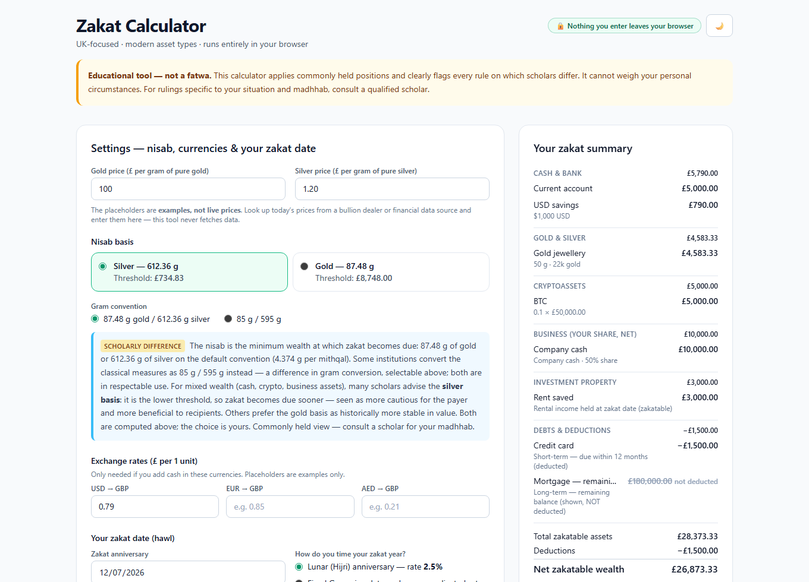

# Zakat Calculator

[](https://github.com/qasimmahmood95/zakat-calculator/actions/workflows/ci.yml)

**Live: <https://qasimmahmood95.github.io/zakat-calculator/>**

A free, private, single-page zakat calculator aimed at UK Muslims with modern
asset types — multi-currency cash, gold and silver, cryptoassets, an
owner-managed limited company, investment property, listed shares, funds and
stocks-&-shares ISAs, pensions, and debts.

<picture>
  <source media="(prefers-color-scheme: dark)" srcset="docs/screenshot-dark.png">
  
</picture>

*Figures shown are the README's worked example — prices are illustrative only.*

**Everything runs in your browser.** No backend, no accounts, no analytics, no
cookies — and the page makes **no network requests at all** (the Tailwind CSS
build is committed to the repo). Figures are autosaved to your browser's local
storage only, a "Clear all data" button wipes them, and you can export/import
everything as a JSON file that stays on your device — a private year-on-year
record.

> **Educational tool — not a fatwa.** This calculator applies commonly held
> positions and flags every rule on which scholars differ. It cannot weigh
> your personal circumstances. For rulings specific to your situation and
> madhhab, consult a qualified scholar.

## Running it

It is a static page — nothing to build or install:

- use the live page above, or
- open `index.html` directly in a browser, or
- serve the folder (`npx serve .` or `python -m http.server`) and browse to it.

The stylesheet (`styles.css`) is a committed Tailwind build. It only needs
rebuilding if you change markup or styles: `npm run build:css` (compiles
`styles.src.css` with a pinned Tailwind — no dependencies are installed into
the repo).

## Running the tests

All calculation logic lives in [`calc.js`](calc.js) (pure functions, no DOM,
no I/O) and is unit-tested with plain Node — no test framework to install:

```
node calc.test.js
```

The suite covers input sanitisation, rounding, currency conversion, metal
purity and valuation, each asset category (including investment and pension
proportion clamping and blank-proportion exclusion), nisab boundary conditions (exactly
at nisab, a penny below, missing prices), the lunar/Gregorian rate adjustment,
Hijri conversion (real-world Umm al-Qura anchor dates, the true
next-anniversary calculation, and the 30th-of-the-month edge case), and a full
worked example (documented inside the test file) whose expected zakat is
checked to the penny.

## The fiqh positions taken, and why

This tool never fabricates citations and never attributes positions to named
scholars. Where schools of law (madhhabs) are named, it is at the level of
well-known school positions only. Every one of the items below is also flagged
in the UI next to the relevant input.

| Topic | Position applied | Status |
| --- | --- | --- |
| **Nisab thresholds** | 87.48 g gold / 612.36 g silver (4.374 g per mithqal convention) by default | Convention differs: some institutions use 85 g / 595 g — both are selectable in the UI, and the printout records which was used. Constants are in one place in `calc.js`. |
| **Nisab basis for mixed wealth** | User chooses; silver is the default with a neutral note | Many scholars advise silver because it is the lower threshold — more cautious for the payer and more beneficial to recipients. Others prefer gold as historically more stable. Both thresholds are always shown. |
| **Zakat rate** | 2.5% per lunar year | Broad agreement. |
| **Hawl (zakat year)** | Lunar year; assessment of what is held on the zakat date, provided nisab was held at both ends of the year. The zakat date and next anniversary are shown as true Hijri dates using the built-in Umm al-Qura calendar (`Intl.DateTimeFormat`, no dependency), falling back to a 354-day approximation only where unsupported | Schools differ on whether dipping below nisab mid-year restarts the hawl — flagged. Umm al-Qura is a *calculated* calendar: local moon sighting may differ by a day or two, stated in the UI. |
| **Fixed Gregorian zakat date** | Optional adjusted rate of ≈2.577% (2.5% × 365.25 ÷ 354.367) | An approximation used by some institutions because a Gregorian year is ~11 days longer than a lunar year. Clearly labelled an approximation; tracking a Hijri date is recommended instead. |
| **Gold/silver valuation** | Metal content: grams × purity × price per gram (or a directly entered value) | Valuing metal content rather than retail/workmanship value is the commonly held basis. |
| **UK legal-tender gold coins** | Fully zakatable at gold value | The CGT exemption on Sovereigns/Britannias is a UK tax rule with no bearing on zakat. Stated in the UI so nobody draws the wrong inference. |
| **Personal-use jewellery** | The tool counts whatever the user enters; the difference is explained so users following an exemption view can leave items out | Hanafi school: gold/silver zakatable however used. Majority of other schools: customary personal-use jewellery exempt. |
| **Cryptoassets** | Zakatable at full market value, manually entered price | The commonly held contemporary view for crypto held as an investment. The tool makes no API calls; a dated note makes price accuracy the user's responsibility. Staking/DeFi are out of scope. |
| **Limited company (owner-managed)** | Ownership % × (cash + receivables + stock − short-term liabilities), floored at zero | A known difference area: proportional-assets versus market-value approaches, and the treatment of doubtful receivables (commonly: good debts annually, doubtful debts when recovered). The section is not designed for passive/listed holdings. Company liabilities never offset *personal* wealth (hence the floor at zero). |
| **Investment property** | Rental income held at the zakat date: zakatable. Property held for income: not zakatable (recorded, shown as excluded). Property bought for resale: trade stock at market value | Commonly held. The mixed/changed-intention case is a difference area and is flagged. The UI warns against double-counting rent already in a bank balance. |
| **Debts owed by you** | Deduct liabilities due within the coming year, including the next 12 months of long-term instalments; the remaining long-term balance (e.g. mortgage principal) is shown but **not** deducted | A well-known difference of opinion. The minority full-deduction position is stated in the UI, and the excluded balance appears in the breakdown so a user can take the figure to a scholar. |
| **Listed shares, funds & ISAs** | Intention decides: holdings bought to resell are trade stock, zakatable at full market value. Long-term holdings: the user chooses per holding between full market value (the simpler, more cautious approach) and a user-entered zakatable-assets proportion | A known difference area: full-market-value versus zakatable-assets-proportion approaches for long-term holdings. Some institutions publish proxy percentages for listed funds; this tool bakes none in — the user enters their own figure, and a blank proportion excludes the holding and flags it rather than guessing. Cash ISAs and dividends already received belong with cash (the UI warns against double-counting). |
| **Pensions** | DC pots: the user chooses per pot between annual zakat on a user-entered zakatable proportion of the pot value, and exclusion until access/receipt (recorded, shown as excluded). DB schemes: recorded but excluded until amounts are received | A significant difference area — both DC positions are stated neutrally in the UI (owned wealth invested on your behalf → annual zakat on the zakatable underlying proportion, versus no effective access until retirement → zakat when accessible/received). Employer-vs-personal contributions and unvested amounts are flagged as beyond the tool's granular scope. |
| **Rounding** | Zakat due is rounded **up** to the penny | So rounding can never cause an underpayment. |

### Deliberately out of scope (for now)

Known asset types this version does not model — better to say so than to
half-model them:

- **Money owed *to* you** (personal receivables/loans to others).
- **Agricultural produce, livestock, and mined wealth** — different rates and
  rules entirely.

## Project structure

```
index.html          — the page: structure and fiqh notes
app.js              — UI wiring only: rows, state, autosave, rendering (no arithmetic)
calc.js             — every calculation, commented, pure functions (browser + Node)
calc.test.js        — zero-dependency unit tests: node calc.test.js
styles.src.css      — stylesheet source (Tailwind directives + components)
styles.css          — committed Tailwind build (npm run build:css)
tailwind.config.js  — Tailwind config for the build
.github/workflows/  — CI: runs the test suite on every push and PR
docs/               — README screenshots
```

The separation is deliberate: any change to a number anyone might pay zakat
on must happen in `calc.js` and be covered by a test.

## Roadmap

- **More currencies** — and a clearer FX-rate workflow.
- **Localisation** — Arabic and Urdu.

## Contributing

Issues and PRs are welcome. Anything that changes a calculation or a stated
fiqh position must (a) keep `node calc.test.js` green and add tests for the
new behaviour, and (b) state the basis of the position at the level of
school/commonly-held views — PRs with fabricated or named-scholar citations
will be declined.

## Licence

[MIT](LICENSE).
